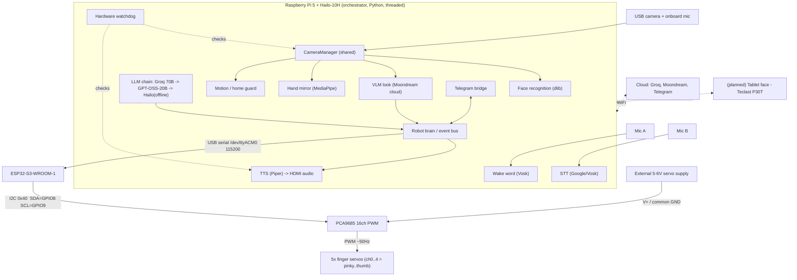

# Schematic — System Overview

Current data-flow and hardware topology of Stella. Mermaid renders on GitHub; an ASCII
version follows for plain-text viewers.

## Block diagram (Mermaid)



## ASCII fallback

```
        Mic A ─────────────► [Wake word]
        Mic B ─────────────► [STT] ──► [LLM chain] ──► [brain] ──► [TTS] ──► HDMI audio
   USB camera ──► [CameraManager] ──► face / VLM / hand-mirror / motion-guard
                                                     │
   Telegram  <──WiFi──►  [brain]  ◄── VLM (Moondream, cloud)
                              │
                              ▼  USB serial /dev/ttyACM0 @115200
                       ESP32-S3-WROOM-1
                              │  I2C 0x40 (SDA=GPIO8, SCL=GPIO9)
                              ▼
                        PCA9685 (16ch PWM, ~50Hz)  ◄── external 5-6V (V+, common GND)
                              │  PWM
                              ▼
        5x finger servos:  ch0=pinky  ch1=ring  ch2=middle  ch3=index  ch4=thumb

   (planned)  Tablet face (P30T) ◄─WiFi ws://<pi>:8765 + http://<pi>:8080─► Pi
```

_Update this when connections change. For a new subsystem, add its nodes/edges here and a
matching entry in `../hardware/wiring.md`._
