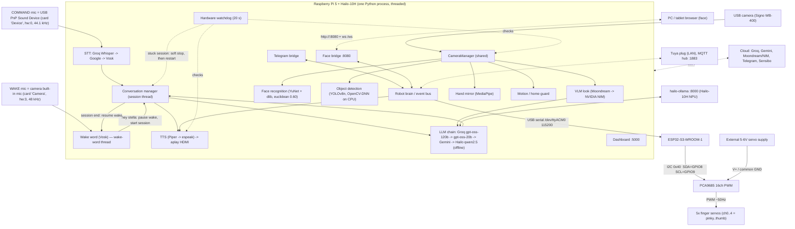

# Schematic — System Overview

Current data-flow and hardware topology of Stella. Mermaid renders on GitHub; an ASCII
version follows for plain-text viewers. Microphone roles are canonical in
[../architecture/stella-architecture.md §4](../architecture/stella-architecture.md#4-audio--the-canonical-two-mic-design).

## Block diagram (Mermaid)


```mermaid
graph TD
    subgraph PI["Raspberry Pi 5 + Hailo-10H  (one Python process, threaded)"]
        BRAIN["Robot brain / event bus"]
        CONV["Conversation manager (session thread)"]
        FACE["Face recognition (YuNet + dlib, euclidean 0.60)"]
        OBJ["Object detection (YOLOv8n, OpenCV-DNN on CPU)"]
        WAKE["Wake word (Vosk) — wake-word thread"]
        STT["STT: Groq Whisper -> Google -> Vosk"]
        TTS["TTS (Piper -> espeak) -> aplay HDMI"]
        AI["LLM chain: Groq gpt-oss-120b -> gpt-oss-20b -> Gemini -> Hailo qwen2.5 (offline)"]
        VLM["VLM look (Moondream -> NVIDIA NIM)"]
        MIRROR["Hand mirror (MediaPipe)"]
        GUARD["Motion / home guard"]
        WATCH["Hardware watchdog (20 s)"]
        TG["Telegram bridge"]
        FB["Face bridge :8080"]
        DASH["Dashboard :5000"]
        CAM["CameraManager (shared)"]
    end

    USBCAM["USB camera (Signo WB-400)"] --> CAM
    MICA["WAKE mic = camera built-in mic (card 'Camera', hw:3, 48 kHz)"] --> WAKE
    MICB["COMMAND mic = USB PnP Sound Device (card 'Device', hw:0, 44.1 kHz)"] --> STT
    CAM --> FACE
    CAM --> OBJ
    CAM --> VLM
    CAM --> MIRROR
    CAM --> GUARD

    WAKE -->|"hey stella": pause wake, start session| CONV
    STT --> CONV
    CONV --> AI
    AI --> CONV
    CONV --> TTS
    CONV -->|session end: resume wake| WAKE
    BRAIN --> TTS
    VLM --> AI
    TG <--> BRAIN
    FB <--> BRAIN
    WATCH -. checks .-> CAM
    WATCH -. checks .-> TTS
    WATCH -. stuck session: soft stop, then restart .-> CONV

    BRAIN -->|USB serial /dev/ttyACM0 115200| ESP["ESP32-S3-WROOM-1"]
    ESP -->|I2C 0x40  SDA=GPIO8 SCL=GPIO9| PCA["PCA9685 16ch PWM"]
    PCA -->|PWM ~50Hz| SERVOS["5x finger servos (ch0..4 = pinky..thumb)"]
    PSU["External 5-6V servo supply"] -->|V+ / common GND| PCA

    HAILO["hailo-ollama :8000 (Hailo-10H NPU)"] <--> AI
    CLOUD["Cloud: Groq, Gemini, Moondream/NIM, Telegram, Sensibo"] <-.WiFi.-> PI
    HOME["Tuya plug (LAN), MQTT hub :1883"] <-.-> BRAIN

    SCREEN["PC / tablet browser (face)"] <-.http://<pi>:8080 + ws /ws.-> FB
```

## ASCII fallback

```
   WAKE mic  = camera built-in mic (card 'Camera', hw:3, 48 kHz) ──► [Wake word / Vosk] ──"hey stella"──┐
   COMMAND mic = USB PnP Sound Device (card 'Device', hw:0, 44.1 kHz) ──► [STT] ──► [Conversation] ◄────┘
                                                        Groq Whisper -> Google -> Vosk        │
                                                                                              ▼
                                        [LLM chain: Groq 120b -> 20b -> Gemini -> Hailo qwen] + tools
                                                                                              │
                                                                                              ▼
                                                        [TTS: Piper -> espeak] ──► aplay ──► HDMI audio
   USB camera ──► [CameraManager] ──► face (YuNet+dlib) / objects (YOLOv8n CPU) / VLM / hand-mirror / guard
                                                     │
   Telegram  <──WiFi──►  [brain]  ◄── VLM (Moondream -> NIM, cloud)
                              │
                              ▼  USB serial /dev/ttyACM0 @115200
                       ESP32-S3-WROOM-1
                              │  I2C 0x40 (SDA=GPIO8, SCL=GPIO9)
                              ▼
                        PCA9685 (16ch PWM, ~50Hz)  ◄── external 5-6V (V+, common GND)
                              │  PWM
                              ▼
        5x finger servos:  ch0=pinky  ch1=ring  ch2=middle  ch3=index  ch4=thumb

   Face bridge :8080 (ws /ws) ◄─WiFi─► PC / tablet browser (Teclast P30T planned as the dedicated screen)
   Watchdog (20 s): camera stale, hand serial, HDMI out, stuck session (75 s soft stop -> +25 s restart)
```

Two mics, two roles, two physical devices — the wake-stream close and the command-stream open never contend for one
ALSA device (single-mic handoff failed: bug_055). Each stream is owned by the thread that opened it.

_Update this when connections change. For a new subsystem, add its nodes/edges here and a
matching entry in `../hardware/wiring.md`._
